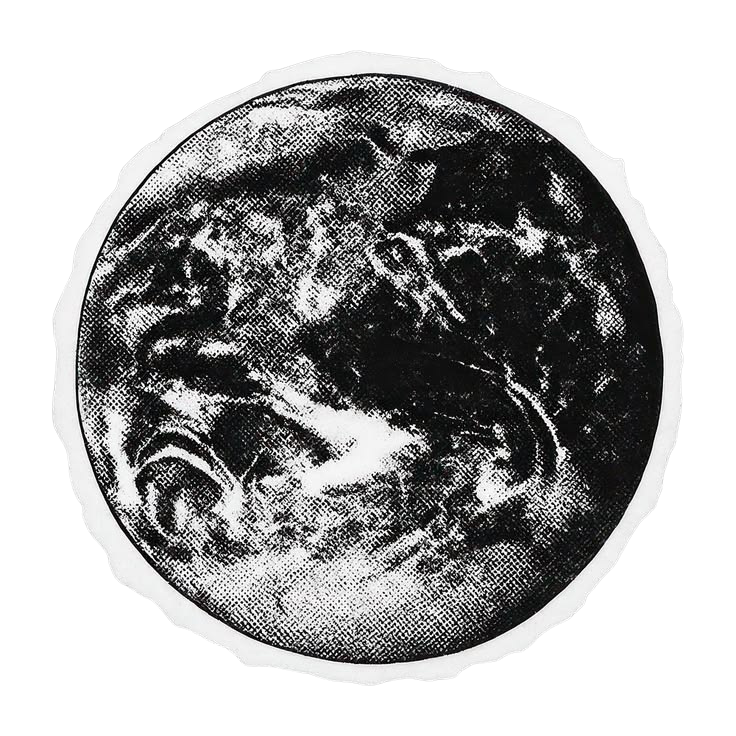

# AhmedKhatib

 Goals this month:
 
 
 Will link repos when I'm done/or a status report

* Finish a website
* 
-Wordle Clone
- Learning:
-A Wikipedia Clone
 -Learning: SQL, Web ui,
  
-Work on Fraus (word game)
-Using data structures

* Learn more of Ui/Ux principles
- CSS
* Fully understand all the DSA/algo fundamentals (review) 
 
* Get into React (if possible)
-Basic Website like a Linktree
